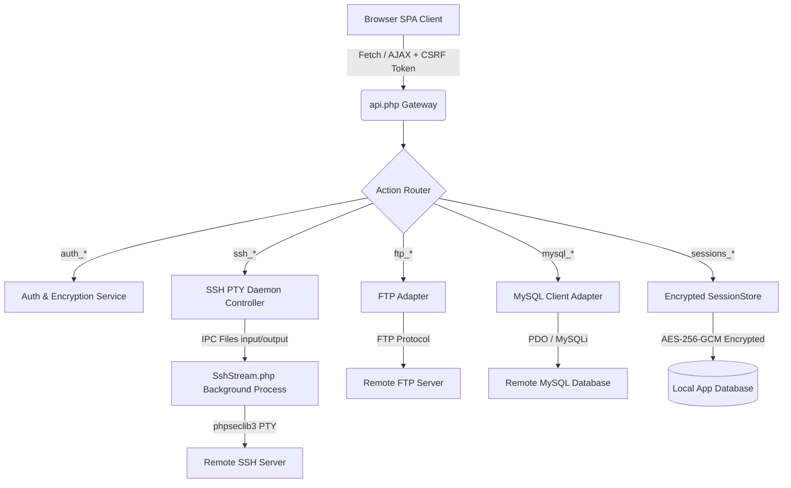

<div align="center">

# 🌐 Fast Tunnel

### *The Ultimate Self-Hosted Web Client for Server Management*

A sleek, responsive, and secure browser-based dashboard consolidating **FileZilla**, **phpMyAdmin**, and **PuTTY** into a single PHP application — zero desktop software required.

[](https://php.net)
[](https://github.com/arizu-id/fast-tunnel)
[](https://github.com/arizu-id/fast-tunnel/releases)
[](https://getbootstrap.com)
[](LICENSE)

[Key Features](#-key-features) • [Architecture](#-architecture) • [Security Matrix](#-security--encryption-architecture) • [Quick Start](#-quick-start) • [Plugins](#-plugin-system) • [Security Hall of Fame](#-security-credits--hall-of-fame)

---

</div>

## 🌟 Overview

**Fast Tunnel** replaces desktop software dependencies with a portable, browser-accessible server workspace. Whether you are managing web hosts, remote databases, or SSH terminals from a mobile device or a restricted workstation, Fast Tunnel provides instant, encrypted access directly from any modern web browser.

Designed for **System Administrators, Web Developers, and DevOps Teams** who demand desktop-grade functionality with web mobility.

---

## ⚡ Key Features

| Module | Features & Capabilities | Engine / Tech |
|---|---|---|
| 📁 **FTP File Manager** | • Drag-and-drop file/folder uploads<br>• Right-click context menu (Rename, Delete, Create, Download)<br>• **Monaco Code Editor** integration (VS Code engine) with `Ctrl+S` save shortcut<br>• Recursive directory traversal & search | Monaco Editor, jQuery ContextMenu |
| 🗄️ **MySQL Database Client** | • Visual Data Grid with pagination<br>• Inline row update and bulk row deletion<br>• SQL Console Runner for custom queries<br>• Database & Table Structure inspector (Add/Edit/Drop columns, indexes) | PDO MySQL / Fallback MySQLi |
| 💻 **SSH Web Terminal** | • Interactive PTY terminal emulator with ANSI color support<br>• Real-time output streaming via **Server-Sent Events (SSE)**<br>• Adaptive polling for low CPU idle consumption<br>• Dynamic terminal window resizing (`cols` x `rows`) | `xterm.js`, `phpseclib3` PTY Daemon |
| 🔐 **Session Management** | • Store multiple FTP, SSH, and MySQL connections securely<br>• Portable encrypted JSON import/export<br>• Client-side password protection for exported session backups | OpenSSL `AES-256-GCM` |
| 🧩 **Modular Plugin Engine** | • Drag-and-drop ZIP plugin installer<br>• Auto-discovery of frontend (`.js`, `.css`) and backend (`plugin.php`) hooks<br>• Pre-built plugins: *Ping Monitor, Multi-Language, Multi-Theme, Proxy* | Fast Tunnel Plugin Architecture |

---

## 🏗️ Architecture

Fast Tunnel employs a lightweight **Single-Page Application (SPA)** frontend coupled with a **Centralized API Gateway** backend:



---

## 🛡️ Security & Encryption Architecture

Security is central to Fast Tunnel's design. Credentials and session tokens are protected across all execution states:

- 🔒 **Zero-Plaintext Credentials Storage**: All passwords, SSH keys, and host details are encrypted using **AES-256-GCM** before database insertion. Kredensial are decrypted only *in-memory* during active API operations.
- 🔑 **Unique Encryption Key**: Each installation generates a 256-bit cryptographically secure random key (`ENCRYPTION_KEY`) in `config.php`.
- 🛡️ **CSRF Protection**: All state-changing `POST` requests require a valid `X-CSRF-Token` header attached to user sessions.
- ⏱️ **Brute-Force Rate Limiting**: Authentication attempts are rate-limited by IP address (maximum 5 failed attempts per 15-minute window).
- 🧱 **Zip-Slip & CWE-434 Defense**: Plugin ZIP uploads perform pre-extraction path validation, `realpath` canonicalization, and strict extension filtering (blocking `.php` webshells, `.htaccess`, `.env`, `.phar`, `.exe`, etc.).
- 🚫 **Web Execution Lockdown**: Direct HTTP access to PHP scripts inside `plugins/`, `backend/`, `vendor/`, `temp_ssh/`, and `scratch/` is blocked via `.htaccess` rules (`RewriteRule ^plugins/.*\.php$ - [F,L]`).

---

## 🚀 Quick Start

### 📋 Prerequisites

- **PHP**: 7.4 or 8.x (PHP 8.1+ recommended)
- **Database**: MySQL 5.7+ or MariaDB 10.3+
- **PHP Extensions**: `pdo_mysql`, `openssl`, `curl`, `zip`
- **Web Server**: Apache (`mod_rewrite` enabled) or Nginx

### 📥 Installation Steps

1. **Clone the Repository**:
   ```bash
   git clone https://github.com/arizu-id/fast-tunnel.git
   cd fast-tunnel
   ```

2. **Install PHP Dependencies**:
   ```bash
   composer install
   ```

3. **Deploy to Web Server**:
   Place the `fast-tunnel` directory inside your web server document root (e.g., `/var/www/html/` or `htdocs/`).

4. **Run Guided Web Installer**:
   Open your browser and navigate to:
   ```http
   http://your-server-ip/fast-tunnel/install/
   ```
   Follow the 3-step installer wizard:
   - **Step 1**: Environment & PHP Extensions Check
   - **Step 2**: Database Connection Configuration
   - **Step 3**: Admin Account & Encryption Key Generation

5. **Security Cleanup**:
   After completing installation, restrict or remove access to the `install/` folder.

---

## 🧩 Plugin System

Fast Tunnel features an extensible plugin architecture. Drop any plugin directory into `plugins/` or upload a ZIP package via the **Plugins Manager UI**.

### Plugin Directory Structure

```
plugins/
└── your_plugin_slug/
    ├── info.json       # Required: Plugin metadata (name, slug, version, author)
    ├── plugin.js       # Optional: Frontend JavaScript module
    ├── plugin.css      # Optional: Styling definitions
    └── plugin.php      # Optional: Backend PHP hooks & logic
```

### Example `info.json`
```json
{
  "name": "Server Latency Monitor",
  "slug": "ping_monitor",
  "version": "1.0.0",
  "description": "Monitors host reachability and ping latency for saved connections.",
  "author": "Arizu Studio"
}
```

---

## 🎖️ Security Credits & Hall of Fame

We extend our sincere thanks to the security research community for helping maintain the safety and integrity of Fast Tunnel through responsible disclosure:

| Researcher / Reporter | Identification | Vulnerability Reported | Status |
|---|---|---|---|
| **VulDB & Security Research Community** | CVE / Submission #990501 | CWE-434 Unrestricted File Upload & Zip-Slip path traversal in plugin installer | 🟢 Patched (v1.0.1) |

> ✉️ **Reporting Vulnerabilities**: If you discover a security issue, please report it responsibly by contacting **`ariefzufar@arizu.id`**.

---

## 📄 License

This project is licensed under the **MIT License** — see the [LICENSE](LICENSE) file for full details. Free for personal and commercial use.

---

<div align="center">

Crafted with ❤️ by **[Arizu Studio](https://arizu.id)**

*Star ⭐ this repository if you find Fast Tunnel useful!*

</div>
