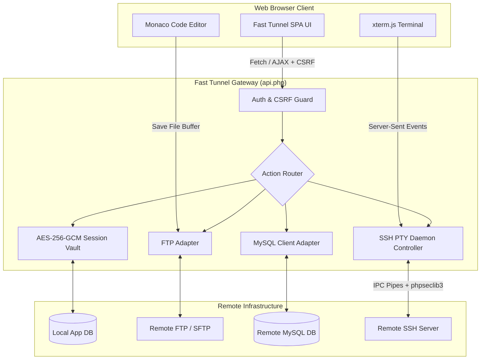

<div align="center">

# 🌐 Fast Tunnel

### *The Ultimate Self-Hosted Web Client for Modern Server Management*

[](https://github.com/arizu-id/fast-tunnel/actions/workflows/ci.yml)
[](https://github.com/arizu-id/fast-tunnel/actions/workflows/security.yml)
[](https://php.net)
[](SECURITY.md)
[](https://github.com/arizu-id/fast-tunnel/releases)
[](docker-compose.yml)
[](LICENSE)

<p align="center">
  A sleek, responsive, and secure browser-based workspace consolidating <b>FileZilla</b>, <b>phpMyAdmin</b>, and <b>PuTTY</b> into a single lightweight PHP application — zero desktop software required.
</p>

<p align="center">
  <a href="#-key-features"><b>Explore Features</b></a> •
  <a href="#-quick-start"><b>Quick Start</b></a> •
  <a href="#-architecture"><b>Architecture</b></a> •
  <a href="#-security--encryption"><b>Security</b></a> •
  <a href="#-plugin-system"><b>Plugins</b></a> •
  <a href="#-troubleshooting"><b>Troubleshooting</b></a> •
  <a href="#-contributing"><b>Contributing</b></a>
</p>

---

</div>

## 🌟 Why Fast Tunnel?

Traditional server administration relies on juggling multiple heavy desktop clients (PuTTY for SSH, FileZilla for FTP, phpMyAdmin / DBeaver for databases). 

**Fast Tunnel** replaces desktop dependencies with a portable, browser-accessible server workspace. Whether you are managing web hosts from a tablet, repairing a database on a restricted corporate workstation, or running SSH commands on the go, Fast Tunnel delivers desktop-grade functionality with web mobility.

```
┌────────────────────────────────────────────────────────────────────────┐
│                        🌐 FAST TUNNEL DASHBOARD                        │
├──────────────────┬──────────────────────┬──────────────────────────────┤
│ 📁 FTP MANAGER   │ 🗄️ MYSQL DATABASE    │ 💻 SSH WEB TERMINAL          │
│ • Monaco Editor  │ • Visual Data Grid   │ • xterm.js PTY Engine        │
│ • Drag & Drop    │ • SQL Console Runner │ • Real-time SSE Stream       │
│ • Context Menu   │ • Schema Inspector   │ • ANSI True-Color Support    │
├──────────────────┴──────────────────────┴──────────────────────────────┤
│ 🔐 Zero-Plaintext Credential Storage (AES-256-GCM Vault)               │
│ 🧩 Extensible Modular Plugin Engine (ZIP Drag & Drop Installer)        │
└────────────────────────────────────────────────────────────────────────┘
```

---

## ⚡ Key Modules & Capabilities

| Module | Features & Highlights | Technology Stack |
|---|---|---|
| 📁 **FTP File Manager** | • Drag-and-drop file & folder upload<br>• Right-click context actions (*Rename, Delete, New File/Folder, Download*)<br>• Embedded **Monaco Code Editor** (VS Code engine) with `Ctrl+S` instant save<br>• Fast directory tree traversal & search | Monaco Editor, jQuery ContextMenu, PHP Streams |
| 🗄️ **MySQL Client** | • Visual Data Grid with pagination and limit offsets<br>• Inline row updating and batch row deletion<br>• Raw SQL query runner with syntax highlighting<br>• Table schema designer (Add/Edit/Drop columns, indexes) | PDO MySQL / MySQLi Fallback |
| 💻 **SSH Web Terminal** | • Full interactive PTY terminal emulator with ANSI color support<br>• High-performance real-time streaming via **Server-Sent Events (SSE)**<br>• Dynamic window resizing (`cols` × `rows`)<br>• Low CPU idle consumption via adaptive polling | `xterm.js`, `phpseclib3` PTY Daemon |
| 🔐 **Session Vault** | • Securely store multiple FTP, SSH, and MySQL profiles<br>• Encrypted JSON profile export and import with PBKDF2 passphrases<br>• One-click instant connection launch | OpenSSL `AES-256-GCM`, PBKDF2 |
| 🧩 **Plugin Engine** | • Drag-and-drop ZIP package installer with auto-discovery<br>• Sandbox execution preventing direct webshell execution<br>• Pre-built plugin hooks for UI themes, ping latency, and proxy tools | Modular PHP / JS Hooks Architecture |

---

## 🏗️ Architecture

Fast Tunnel employs a lightweight **Single-Page Application (SPA)** architecture coupled with a **Centralized API Gateway**:



> 📖 *For a deep dive into streaming mechanics and encryption flows, read [`ARCHITECTURE.md`](ARCHITECTURE.md).*

---

## 🛡️ Security & Encryption Matrix

Security is the core foundation of Fast Tunnel's design:

- 🔒 **Zero-Plaintext at Rest**: Remote passwords, hostnames, and private keys are encrypted using **AES-256-GCM** before database storage. Credentials are only decrypted *in-memory* during active operations.
- 🔑 **Unique Cryptographic Keys**: Every installation generates a cryptographically random 256-bit key (`ENCRYPTION_KEY`).
- 🛡️ **CSRF Defense**: All state-changing requests enforce strict `X-CSRF-Token` headers.
- ⏱️ **Brute-Force Rate Limiting**: Authentication endpoints enforce an automated sliding-window rate limit by IP address.
- 🧱 **Zip-Slip & CWE-434 Hardening**: Plugin ZIP uploads perform canonical `realpath` validation and strict file extension filtering.
- 🚫 **Web Execution Lockdown**: Direct HTTP access to PHP files in `plugins/`, `backend/`, `vendor/`, and `temp_ssh/` is prohibited via `.htaccess` and Nginx rules.

> 🔒 *Read our full security policy and disclosure guidelines in [`SECURITY.md`](SECURITY.md).*

---

## 🚀 Quick Start

### Option 1: Docker Compose (Fastest & Recommended)

Get up and running in 30 seconds with zero local dependencies:

```bash
# 1. Clone repository
git clone https://github.com/arizu-id/fast-tunnel.git
cd fast-tunnel

# 2. Launch container stack
docker-compose up -d --build

# 3. Open Web Installer
# Navigate to: http://localhost:8080/install/
```

---

### Option 2: Apache / PHP-FPM Web Server

```bash
# 1. Clone the repository into your web root
cd /var/www/html
git clone https://github.com/arizu-id/fast-tunnel.git
cd fast-tunnel

# 2. Install PHP dependencies
composer install --optimize-autoloader

# 3. Set proper directory permissions
chmod -R 775 temp_ssh/ plugins/
chown -R www-data:www-data temp_ssh/ plugins/

# 4. Open Guided Web Installer
# Navigate to: http://your-server-ip/fast-tunnel/install/
```

Follow the 3-step installer wizard:
1. **Step 1**: System requirements & PHP extensions check (`pdo_mysql`, `openssl`, `curl`, `zip`).
2. **Step 2**: MySQL database configuration.
3. **Step 3**: Admin user account creation & automated encryption key generation.

---

### Option 3: Nginx + PHP-FPM

For Nginx, copy and customize our production-tested configuration template:

```bash
sudo cp nginx.sample.conf /etc/nginx/sites-available/fast-tunnel
sudo ln -s /etc/nginx/sites-available/fast-tunnel /etc/nginx/sites-enabled/
sudo systemctl reload nginx
```

> ⚠️ **Nginx SSE Tip**: Ensure `fastcgi_buffering off;` and `proxy_buffering off;` are enabled so terminal Server-Sent Events stream without buffering delay.

---

## 🧩 Plugin System

Fast Tunnel features a modular plugin architecture. Build your own plugins or drop community packages into `plugins/`.

```
plugins/
└── your_plugin_slug/
    ├── info.json       # Required: Plugin metadata
    ├── plugin.js       # Optional: Frontend JavaScript hooks
    ├── plugin.css      # Optional: Frontend styling
    └── plugin.php      # Optional: Backend PHP API handlers
```

### Sample `info.json`
```json
{
  "name": "Server Latency Monitor",
  "slug": "ping_monitor",
  "version": "1.0.0",
  "description": "Monitors host reachability and ping latency for saved connections.",
  "author": "Arizu Studio"
}
```

---

## 🎖️ Security Credits & Hall of Fame

We extend our sincere thanks to the security research community for helping protect Fast Tunnel users through responsible disclosure:

| Researcher / Reporter | Identification | Vulnerability Reported | Status |
|---|---|---|---|
| **VulDB & Research Community** | Submission #990501 | CWE-434 Unrestricted File Upload & Zip-Slip path traversal in plugin installer | 🟢 Patched (v1.0.1) |

> ✉️ *Found a security issue? Please review [`SECURITY.md`](SECURITY.md) and report confidentially to **`ariefzufar@arizu.id`**.*

---

## 🗺️ Roadmap

- [ ] **v1.1**: Official Docker Hub prebuilt image, SQLite zero-config mode, 2FA/TOTP authenticator.
- [ ] **v1.2**: Multi-tab terminal sessions, database SQL export/import tools, cloud archive utilities.
- [ ] **v2.0**: Multi-user Role-Based Access Control (RBAC), browser-based RDP/VNC remote desktop.

Check out the full development timeline in [`ROADMAP.md`](ROADMAP.md).

---

## 🤝 Contributing

Contributions, issues, and feature requests are very welcome!
- Check out [`CONTRIBUTING.md`](CONTRIBUTING.md) to get started with our development workflow.
- Please adhere to our [`CODE_OF_CONDUCT.md`](CODE_OF_CONDUCT.md).
- To report a bug or request a feature, use our [GitHub Issue Templates](https://github.com/arizu-id/fast-tunnel/issues/new/choose).

---

## 📄 License

This project is licensed under the **MIT License** — see the [LICENSE](LICENSE) file for details. Free for personal and commercial use.

---

<div align="center">

Crafted with ❤️ by **[Arizu Studio](https://arizu.id)**

⭐ **Star this repository if you find Fast Tunnel useful!** ⭐

</div>
